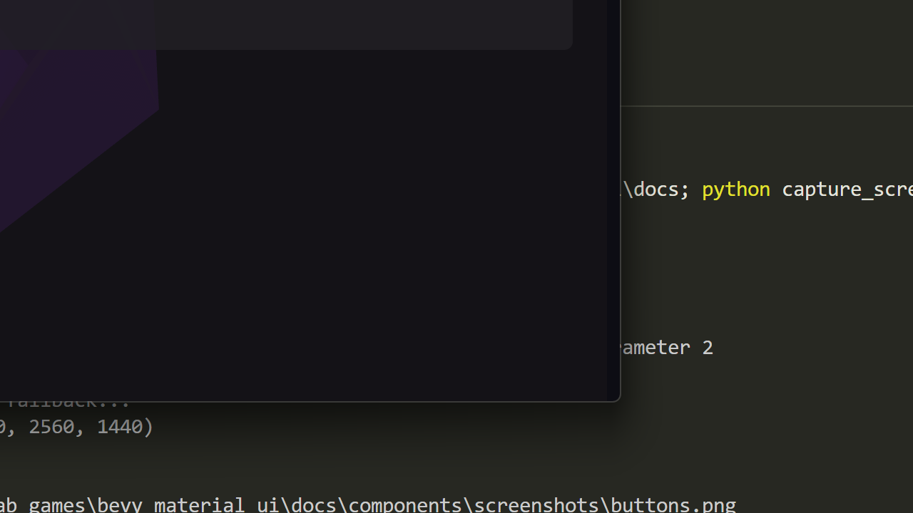

# Checkbox

Material Design 3 checkbox component with animation support.



## States

| State | Description |
|-------|-------------|
| `Unchecked` | Empty checkbox |
| `Checked` | Filled with checkmark |
| `Indeterminate` | Partially selected (dash icon) |

## Basic Usage

```rust
use bevy_material_ui::prelude::*;
use bevy_material_ui::checkbox::CheckboxState;

fn setup(mut commands: Commands, theme: Res<MaterialTheme>) {
    // Basic checkbox with label
    commands.spawn_checkbox(&theme, CheckboxState::Unchecked, "Accept terms");

    // Pre-checked checkbox
    commands.spawn_checkbox(&theme, CheckboxState::Checked, "Subscribe to newsletter");

    // Indeterminate state (for parent checkboxes)
    commands.spawn_checkbox(&theme, CheckboxState::Indeterminate, "Select all");
}
```

## Handling Changes

```rust
use bevy_material_ui::checkbox::CheckboxChangeEvent;

fn handle_checkbox_changes(
    mut reader: EventReader<CheckboxChangeEvent>,
) {
    for event in reader.read() {
        println!("Checkbox {:?} changed to {:?}", event.entity, event.new_state);
    }
}
```

## Disabled State

```rust
// Create a disabled checkbox using direct component spawning
commands.spawn((
    MaterialCheckbox::new()
        .with_state(CheckboxState::Checked)
        .disabled(true),
    // ... other required components
));
```

## Error State

```rust
// Checkbox with error indication
commands.spawn((
    MaterialCheckbox::new().with_error(true),
    // ... other required components
));
```

## CheckboxChangeEvent

| Field | Type | Description |
|-------|------|-------------|
| `entity` | `Entity` | The checkbox entity |
| `new_state` | `CheckboxState` | The new checkbox state |
| `old_state` | `CheckboxState` | The previous state |

## Properties

| Property | Type | Default | Description |
|----------|------|---------|-------------|
| `state` | `CheckboxState` | `Unchecked` | Current checkbox state |
| `disabled` | `bool` | `false` | Disables interaction |
| `error` | `bool` | `false` | Shows error styling |

## Animation

Checkboxes include smooth animations when toggling:
- Check icon scales and fades in
- State transitions use MD3 emphasized easing
- Animation duration follows MD3 motion tokens
