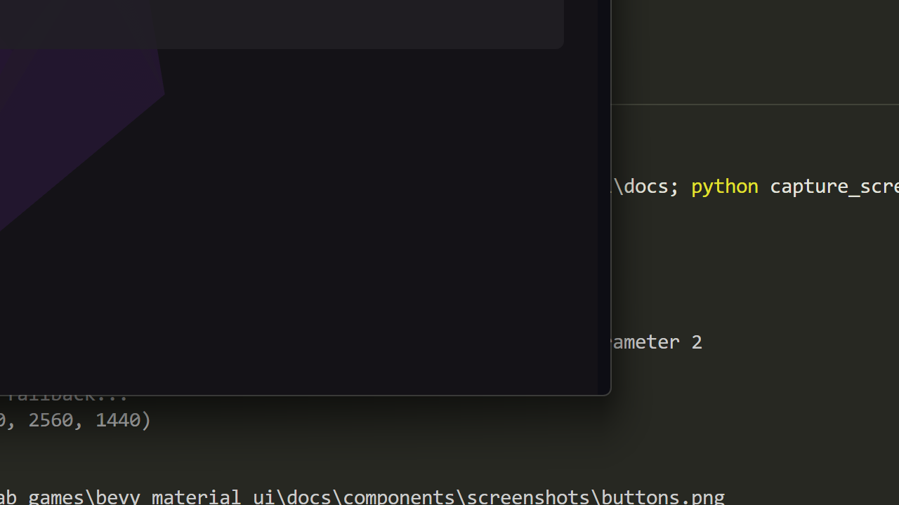

# FAB (Floating Action Button)

Material Design 3 floating action button for primary actions.



## Variants

| Variant | Description | Size |
|---------|-------------|------|
| `Small` | Compact FAB | 40dp |
| `Regular` | Standard FAB | 56dp |
| `Large` | Large FAB | 96dp |
| `Extended` | FAB with label | Auto |

## Basic Usage

```rust
use bevy_material_ui::prelude::*;

fn setup(mut commands: Commands, theme: Res<MaterialTheme>) {
    // Regular FAB
    MaterialFab::new(ICON_ADD)
        .spawn(&mut commands, &theme);

    // Extended FAB with label
    MaterialFab::new(ICON_EDIT)
        .extended("Compose")
        .spawn(&mut commands, &theme);

    // Small FAB
    MaterialFab::new(ICON_ADD)
        .small()
        .spawn(&mut commands, &theme);

    // Large FAB
    MaterialFab::new(ICON_ADD)
        .large()
        .spawn(&mut commands, &theme);
}
```

## Color Variants

```rust
// Primary (default)
MaterialFab::new(ICON_ADD)
    .spawn(&mut commands, &theme);

// Secondary
MaterialFab::new(ICON_ADD)
    .secondary()
    .spawn(&mut commands, &theme);

// Tertiary
MaterialFab::new(ICON_ADD)
    .tertiary()
    .spawn(&mut commands, &theme);

// Surface
MaterialFab::new(ICON_ADD)
    .surface()
    .spawn(&mut commands, &theme);
```

## Lowered FAB

```rust
// Lower elevation when scrolled
MaterialFab::new(ICON_ADD)
    .lowered()
    .spawn(&mut commands, &theme);
```

## Handling Clicks

```rust
fn handle_fab_clicks(
    mut reader: EventReader<FabClickEvent>,
) {
    for event in reader.read() {
        println!("FAB clicked: {:?}", event.entity);
    }
}
```

## Properties

| Property | Type | Default | Description |
|----------|------|---------|-------------|
| `icon` | `String` | Required | FAB icon |
| `label` | `Option<String>` | `None` | Extended FAB label |
| `size` | `FabSize` | `Regular` | FAB size variant |
| `color_variant` | `FabColorVariant` | `Primary` | Color scheme |
| `lowered` | `bool` | `false` | Reduce elevation |

## State Layers

FABs apply MD3 state layers:
- **Hover**: 8% opacity overlay
- **Pressed**: 12% opacity overlay

## Positioning

FABs are typically positioned at the bottom-right of the screen:

```rust
commands.spawn((
    Node {
        position_type: PositionType::Absolute,
        bottom: Val::Px(16.0),
        right: Val::Px(16.0),
        ..default()
    },
    // FAB component...
));
```
