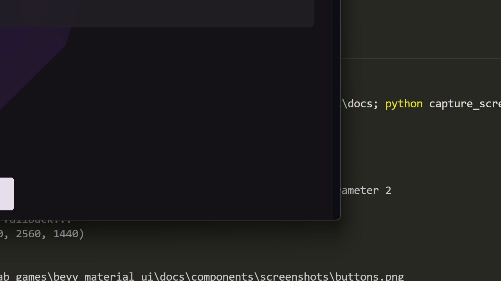

# Icon Button

Material Design 3 icon-only button component.



## Variants

| Variant | Description |
|---------|-------------|
| `Standard` | No container, icon only |
| `Filled` | Solid background |
| `FilledTonal` | Tonal background |
| `Outlined` | Border outline |

## Basic Usage

```rust
use bevy_material_ui::prelude::*;

fn setup(mut commands: Commands, theme: Res<MaterialTheme>) {
    // Standard icon button
    MaterialIconButton::new(ICON_FAVORITE)
        .spawn(&mut commands, &theme);

    // Filled
    MaterialIconButton::new(ICON_ADD)
        .with_variant(IconButtonVariant::Filled)
        .spawn(&mut commands, &theme);

    // Tonal
    MaterialIconButton::new(ICON_EDIT)
        .with_variant(IconButtonVariant::FilledTonal)
        .spawn(&mut commands, &theme);

    // Outlined
    MaterialIconButton::new(ICON_SHARE)
        .with_variant(IconButtonVariant::Outlined)
        .spawn(&mut commands, &theme);
}
```

## Toggle Button

```rust
// Toggleable icon button
MaterialIconButton::new(ICON_FAVORITE)
    .toggleable()
    .spawn(&mut commands, &theme);

// Pre-selected toggle
MaterialIconButton::new(ICON_STAR)
    .toggleable()
    .selected(true)
    .spawn(&mut commands, &theme);
```

## Different Icons for States

```rust
// Different icon when selected
MaterialIconButton::new(ICON_FAVORITE_BORDER)
    .toggleable()
    .with_selected_icon(ICON_FAVORITE)
    .spawn(&mut commands, &theme);
```

## Disabled State

```rust
MaterialIconButton::new(ICON_DELETE)
    .disabled(true)
    .spawn(&mut commands, &theme);
```

## Handling Clicks

```rust
fn handle_icon_button_clicks(
    buttons: Query<(&Interaction, &MaterialIconButton), Changed<Interaction>>,
) {
    for (interaction, button) in buttons.iter() {
        if *interaction == Interaction::Pressed {
            println!("Icon button clicked: {}", button.icon);
        }
    }
}
```

## Properties

| Property | Type | Default | Description |
|----------|------|---------|-------------|
| `icon` | `String` | Required | Icon character |
| `variant` | `IconButtonVariant` | `Standard` | Button style |
| `disabled` | `bool` | `false` | Disabled state |
| `toggleable` | `bool` | `false` | Enable toggle behavior |
| `selected` | `bool` | `false` | Toggle state |
| `selected_icon` | `Option<String>` | `None` | Icon when selected |

## State Layers

Icon buttons apply MD3 state layers:
- **Hover**: 8% opacity overlay
- **Pressed**: 12% opacity overlay
