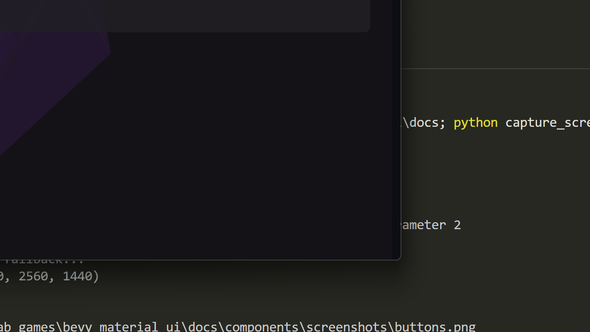

# Radio

Material Design 3 radio button component for single selection.



## Basic Usage

```rust
use bevy_material_ui::prelude::*;

fn setup(mut commands: Commands, theme: Res<MaterialTheme>) {
    // Create a radio group
    let group_id = commands.spawn_empty().id();
    
    commands.spawn_radio(&theme, group_id, "option1", "Option 1", true);  // Selected
    commands.spawn_radio(&theme, group_id, "option2", "Option 2", false);
    commands.spawn_radio(&theme, group_id, "option3", "Option 3", false);
}
```

## Handling Changes

```rust
use bevy_material_ui::radio::RadioChangeEvent;

fn handle_radio_changes(
    mut reader: EventReader<RadioChangeEvent>,
) {
    for event in reader.read() {
        println!("Radio selected: {} (group {:?})", event.value, event.group);
    }
}
```

## Disabled State

```rust
commands.spawn((
    MaterialRadio::new(group_id, "disabled_option")
        .disabled(true),
    // ... other components
));
```

## Vertical Layout

```rust
fn spawn_radio_group(commands: &mut Commands, theme: &MaterialTheme) {
    commands.spawn((
        Node {
            flex_direction: FlexDirection::Column,
            row_gap: Val::Px(8.0),
            ..default()
        },
    )).with_children(|parent| {
        let group_id = parent.parent_entity();
        
        parent.spawn_radio(theme, group_id, "a", "Choice A", true);
        parent.spawn_radio(theme, group_id, "b", "Choice B", false);
        parent.spawn_radio(theme, group_id, "c", "Choice C", false);
    });
}
```

## RadioChangeEvent

| Field | Type | Description |
|-------|------|-------------|
| `entity` | `Entity` | The radio button entity |
| `group` | `Entity` | The radio group entity |
| `value` | `String` | The selected value |

## Properties

| Property | Type | Default | Description |
|----------|------|---------|-------------|
| `group` | `Entity` | Required | Radio group identifier |
| `value` | `String` | Required | Value when selected |
| `selected` | `bool` | `false` | Selection state |
| `disabled` | `bool` | `false` | Disabled state |

## Animation

Radio buttons include smooth selection animations with MD3 motion tokens.
