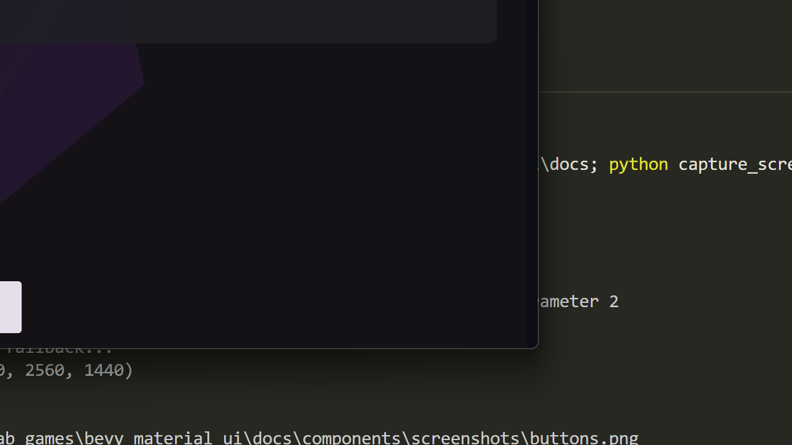

# Slider

Material Design 3 slider component for range selection.



## Types

| Type | Description |
|------|-------------|
| Continuous | Smooth value selection |
| Discrete | Step-based selection with tick marks |

## Basic Usage

```rust
use bevy_material_ui::prelude::*;

fn setup(mut commands: Commands, theme: Res<MaterialTheme>) {
    // Continuous slider (0-100)
    MaterialSlider::new()
        .spawn(&mut commands, &theme);

    // With initial value
    MaterialSlider::new()
        .value(50.0)
        .spawn(&mut commands, &theme);
}
```

## Custom Range

```rust
// Slider from 0 to 1000
MaterialSlider::new()
    .min(0.0)
    .max(1000.0)
    .value(500.0)
    .spawn(&mut commands, &theme);
```

## Discrete Slider

```rust
// Slider with 10 steps
MaterialSlider::new()
    .discrete()
    .steps(10)
    .spawn(&mut commands, &theme);
```

## With Label

```rust
MaterialSlider::new()
    .label("Volume")
    .spawn(&mut commands, &theme);
```

## Disabled State

```rust
MaterialSlider::new()
    .value(30.0)
    .disabled(true)
    .spawn(&mut commands, &theme);
```

## Handling Changes

```rust
use bevy_material_ui::slider::SliderChangeEvent;

fn handle_slider_changes(
    mut reader: EventReader<SliderChangeEvent>,
) {
    for event in reader.read() {
        println!("Slider value: {}", event.value);
    }
}
```

## Reading Current Value

```rust
fn read_slider_values(
    sliders: Query<&MaterialSlider>,
) {
    for slider in sliders.iter() {
        println!("Current value: {}", slider.value);
    }
}
```

## Properties

| Property | Type | Default | Description |
|----------|------|---------|-------------|
| `value` | `f32` | `0.0` | Current value |
| `min` | `f32` | `0.0` | Minimum value |
| `max` | `f32` | `100.0` | Maximum value |
| `discrete` | `bool` | `false` | Enable discrete mode |
| `steps` | `u32` | `10` | Number of discrete steps |
| `disabled` | `bool` | `false` | Disabled state |
| `label` | `Option<String>` | `None` | Slider label |

## SliderChangeEvent

| Field | Type | Description |
|-------|------|-------------|
| `entity` | `Entity` | The slider entity |
| `value` | `f32` | New slider value |
| `normalized` | `f32` | Value from 0.0 to 1.0 |

## Visual Elements

- **Track**: Background line
- **Active Track**: Filled portion showing current value
- **Handle**: Draggable thumb
- **Tick Marks**: Discrete step indicators (discrete mode only)
