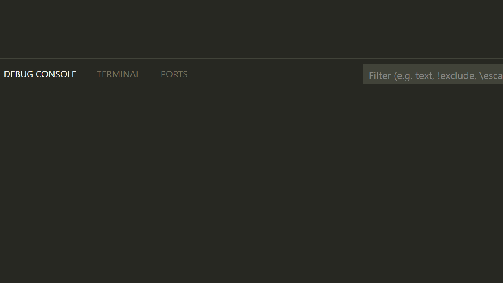

# Snackbar

Material Design 3 snackbar component for brief notifications.



## Basic Usage

```rust
use bevy_material_ui::prelude::*;
use bevy_material_ui::snackbar::{ShowSnackbar, SnackbarHostBuilder};

fn setup(mut commands: Commands, theme: Res<MaterialTheme>) {
    // Add snackbar host to your UI root
    SnackbarHostBuilder::new()
        .spawn(&mut commands, &theme);
}

// Show a snackbar
fn show_notification(
    mut writer: MessageWriter<ShowSnackbar>,
) {
    writer.write(ShowSnackbar::message("Operation completed"));
}
```

## With Action

```rust
fn show_with_action(
    mut writer: MessageWriter<ShowSnackbar>,
) {
    writer.write(
        ShowSnackbar::with_action("File deleted", "UNDO")
    );
}
```

## Custom Duration

```rust
use bevy_material_ui::snackbar::SnackbarDuration;

fn show_custom_duration(
    mut writer: MessageWriter<ShowSnackbar>,
) {
    // Short duration (4 seconds)
    writer.write(
        ShowSnackbar::message("Quick message")
            .duration(SnackbarDuration::Short)
    );

    // Long duration (10 seconds)
    writer.write(
        ShowSnackbar::message("Important message")
            .duration(SnackbarDuration::Long)
    );

    // Indefinite (stays until dismissed)
    writer.write(
        ShowSnackbar::message("Persistent message")
            .duration(SnackbarDuration::Indefinite)
    );
}
```

## Handling Action Clicks

```rust
use bevy_material_ui::snackbar::SnackbarActionEvent;

fn handle_snackbar_action(
    mut reader: EventReader<SnackbarActionEvent>,
) {
    for event in reader.read() {
        if event.action_label == "UNDO" {
            println!("Undo action triggered!");
            // Perform undo logic
        }
    }
}
```

## Multiple Snackbars

Snackbars queue automatically. When one is dismissed, the next appears.

```rust
fn show_multiple(
    mut writer: MessageWriter<ShowSnackbar>,
) {
    writer.write(ShowSnackbar::message("First message"));
    writer.write(ShowSnackbar::message("Second message"));
    writer.write(ShowSnackbar::message("Third message"));
}
```

## ShowSnackbar Methods

| Method | Description |
|--------|-------------|
| `message(text)` | Create snackbar with message only |
| `with_action(text, action)` | Create snackbar with action button |
| `duration(duration)` | Set display duration |

## SnackbarDuration

| Variant | Duration | Description |
|---------|----------|-------------|
| `Short` | 4 seconds | Quick notifications |
| `Long` | 10 seconds | Important messages |
| `Indefinite` | Forever | Requires manual dismiss |

## Properties

| Property | Type | Default | Description |
|----------|------|---------|-------------|
| `message` | `String` | Required | Snackbar text |
| `action_label` | `Option<String>` | `None` | Action button text |
| `duration` | `SnackbarDuration` | `Short` | Display duration |

## Positioning

The SnackbarHost should be positioned at the bottom of the screen:

```rust
SnackbarHostBuilder::new()
    .spawn(&mut commands, &theme);

// The host automatically positions snackbars at the bottom
```
