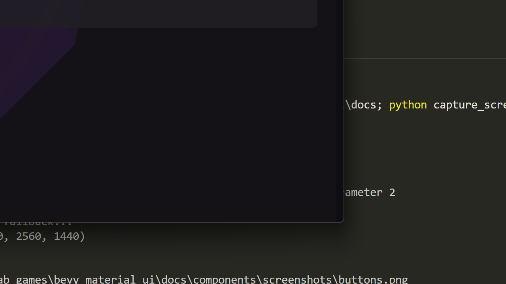

# Switch

Material Design 3 toggle switch component.



## Basic Usage

```rust
use bevy_material_ui::prelude::*;

fn setup(mut commands: Commands, theme: Res<MaterialTheme>) {
    // Off switch with label
    commands.spawn_switch(&theme, false, "Enable notifications");

    // On switch
    commands.spawn_switch(&theme, true, "Dark mode");
}
```

## With Icons

```rust
// Switch with icon shown when on
commands.spawn_switch_with_icon(&theme, true, "Airplane mode", ICON_AIRPLANEMODE_ACTIVE);
```

## Handling Changes

```rust
use bevy_material_ui::switch::SwitchChangeEvent;

fn handle_switch_changes(
    mut reader: EventReader<SwitchChangeEvent>,
) {
    for event in reader.read() {
        println!("Switch {:?} is now: {}", event.entity, event.on);
    }
}
```

## Disabled State

```rust
commands.spawn((
    MaterialSwitch::new()
        .on(true)
        .disabled(true),
    // ... other components
));
```

## Reading State

```rust
fn read_switch_states(
    switches: Query<&MaterialSwitch>,
) {
    for switch in switches.iter() {
        println!("Switch is on: {}", switch.on);
    }
}
```

## Programmatic Toggle

```rust
fn toggle_switch(
    mut switches: Query<&mut MaterialSwitch>,
) {
    for mut switch in switches.iter_mut() {
        switch.on = !switch.on;
    }
}
```

## SwitchChangeEvent

| Field | Type | Description |
|-------|------|-------------|
| `entity` | `Entity` | The switch entity |
| `on` | `bool` | New switch state |

## Properties

| Property | Type | Default | Description |
|----------|------|---------|-------------|
| `on` | `bool` | `false` | Toggle state |
| `disabled` | `bool` | `false` | Disabled state |
| `icon` | `Option<String>` | `None` | Icon when on |

## Animation

Switches include smooth thumb animation when toggling between states.
